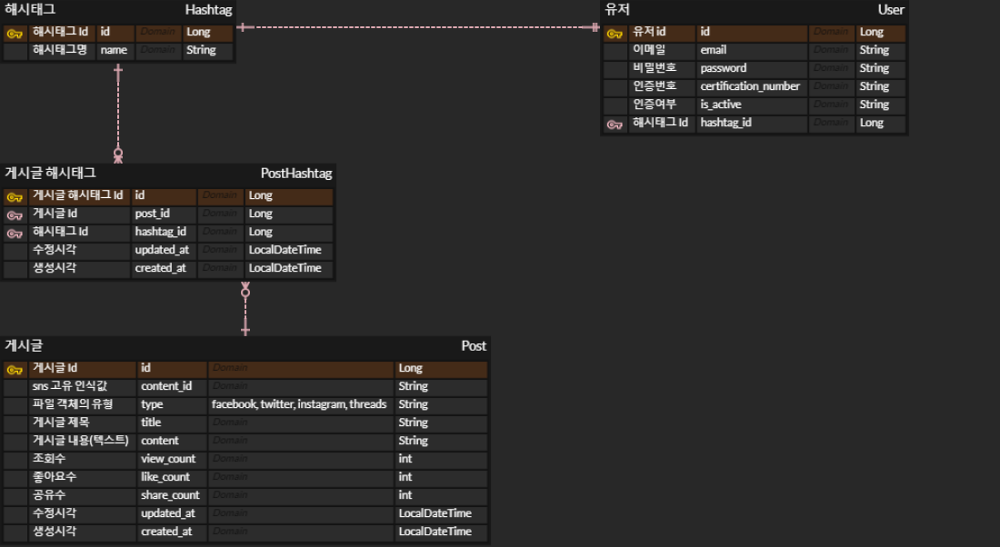

본 "MINE" 브랜치는 팀 프로젝트 "소셜 미디어 통합 Feed 서비스 MOA"의 GitHub repository를 본인의 GitHub으로 fork한 후, 다시 새롭게 분기한 브랜치이다.
  
분기한 목적은 (1) 팀 프로젝트에서 본인이 구현한 기능의 포트폴리오 (2) 추후 본인이 의도한대로 코드 리팩토링 또는 기능 추가
  
* (팀 프로젝트 확인 : https://github.com/Team-Enigma23/social-media-integration-feed-project)
  
---
  
# :pushpin: 소셜 미디어 통합 Feed 서비스 MOA
> **소셜 미디어 Feed 여기 다 MOA!** 
> 
> 복수의 SNS 게시물 중 유저의 해시태그가 포함된 게시물들을 하나의 서비스에서 확인할 수 있는 통합 Feed 어플리케이션
  
## <포트폴리오 순서>
1. [제작기간 및 참여인원](#1제작기간-및-참여인원) 
2. [개요](#2개요)  
3. [사용기술](#3사용기술)  
4. [ERD 설계](#4erd-설계)
5. [본인 구현 기능](#5본인-구현-기능)
6. [트러블 슈팅 & TIL](#6트러블-슈팅--til)
7. [회고](#7회고)
  
- [Git commit 메시지 컨벤션](#Git-commit-메시지-컨벤션)
- [본인 구현 API Reference](#본인-구현-api-reference)
  
## 1.제작기간 및 참여인원
- 제작기간 : 2023년 10월 25일 ~ 10월 30일
- 팀 프로젝트 (총 5명 / 모두 Java, Spring 기반 백엔드 개발자)
  
## 2.개요
  
본 서비스는 유저 계정의 해시태그(”#dani”) 를 기반으로 인스타그램, 스레드, 페이스북, 트위터 등 복수의 SNS에 게시된 게시물 중 유저의 해시태그가 포함된 게시물들을 하나의 서비스에서 확인할 수 있는 통합 Feed 어플리케이션 입니다.
  
## 3.사용기술
- 언어 및 프레임워크 :  <br/>
- 데이터베이스 :  <br/>
- 배포 :  <br/>
  
## 4.ERD 설계
>  <br/>
사용자는 자신의 해시태그를 등록하고, 해당 해시태그를 기반으로 게시물을 조회할 수 있습니다.
    
## 5.본인 구현 기능

- SNS피드(POST) 대상으로 조회, 상세 조회, 좋아요 및 공유 API 구현 / dummy data 생성
  
<details>

1. 게시글 리스트 조회  
   - **`:hashtag`** 매개변수에 따라 **`Post`** 엔티티에서 게시물을 검색
       - Querydsl 활용하여 검색어를 포함한 모든 게시글을 검색 후, 검색 결과를 offset 방식의 pagination 및 최신순(생성일자 기준)으로 노출
   - 검색한 결과에 Pagination 및 Sort 적용
       - offset 방식의 pagination 구현, 최신순(생성일자 기준)으로 정렬
  
  
2. 개별 게시글 상세 조회
  
  
3. 개별 게시글에 대한 좋아요/공유 (생성)
   - SNS게시물에 대한 좋아요/공유가 발생했을 경우 본 서비스에서 자동적으로 이를 인지하는 것이 자연스러우나, 프로젝트의 조건에 따라 임의로 좋아요/공유를 생성시켰음.
   - 따라서 API 실행 시 좋아요/공유 수를 +1하면서 해당 피드들을 호출하도록 구현 (실제 호출되지는 않음)
  
  
4. 구현한 API의 정상 작동여부를 간편하게 테스트하기 위한 dummy data (dummy Post) 구현
   - ApplicationRunner 인터페이스를 구현한 DummyDataLoader 클래스, dummy로 생성되어야 할 객체(Post)의 정보들을 입력한 DummyDataService 클래스를 통해 2개의 hastTag, 20개의 post, 8개의 postHashtag가 서버 구동과 동시에 생성됨
</details>
  
  
## 6.트러블 슈팅 & TIL
> 
> 1. 빌더 패턴, 잘 알고 쓰자! (<a href="https://github.com/upqnu/social-media-integration-feed-project/wiki/%EB%B9%8C%EB%8D%94%20%ED%8C%A8%ED%84%B4,%20%EC%9E%98%20%EC%95%8C%EA%B3%A0%20%EC%93%B0%EC%9E%90!">클릭 & detail 확인</a>)
> 
> 2. @NoArgsConstructor, @AllArgsConstructor ; 그냥 쓰면 안 되는 거였냐 (<a href="https://github.com/upqnu/social-media-integration-feed-project/wiki/@NoArgsConstructor,%20@AllArgsConstructor%20;%20%EA%B7%B8%EB%83%A5%20%EC%93%B0%EB%A9%B4%20%EC%95%88%20%EB%90%98%EB%8A%94%20%EA%B1%B0%EC%98%80%EB%83%90?%20%E2%80%A6">클릭 & detail 확인</a>)
> 
> 3. QueryDSL을 활용한 게시물 검색 기능 구현 (with pagination sort) (<a href="https://github.com/upqnu/social-media-integration-feed-project/wiki/QueryDSL%EC%9D%84%20%ED%99%9C%EC%9A%A9%ED%95%9C%20%EA%B2%8C%EC%8B%9C%EB%AC%BC%20%EA%B2%80%EC%83%89%20%EA%B8%B0%EB%8A%A5%20%EA%B5%AC%ED%98%84%20%20(with%20pagination%20+%20sort)">클릭 & detail 확인</a>)
>
   
## 7.회고
  
<details>
<summary>spring boot 프로젝트를 만들어나가는 데 필요한 기본적인 부분을 더 깊게 이해할 수 있는 좋은 기회였다.</summary>

1. 클래스 레벨에서만 선언하고 사용하였던 빌더 패턴을 → 클래스 내부의 생성자에 선언하면, 빌더 패턴은 이 생성자에서 정의한 필드에만 적용된다.
2. '@NoArgsConstructor'에 '(access = AccessLevel.PROTECTED)'라는 속성을 주는 이유는 함부로 또는 불필요하게 기본 생성자가 생성되는 것을 막기 위해서이다.

- (위 트러블 슈팅 2번 참고)
</details>
  <br>
<details>
<summary>단 하나의 API에 적용하긴 했지만 처음으로 queryDSL을 사용하여 게시물 검색 기능을 구현하였다.</summary>
  
- 많은 구글링을 통해 queryDSL을 통해 검색 기능을 구현하였고, 더불어서 @Query를 사용하여 구현하는 방법과의 코드 차이를 알 수 있었다.
- 검색은 많은 스프링 부트 프로젝트에서 구현하는 기능이므로 향후 개인 프로젝트 구현 시, queryDSL을 반드시 활용할 예정이다.

- (위 트러블 슈팅 3번 참고)
</details>
  <br>
<details>
<summary>게시물 좋아요, 공유 기능 구현에서 팀원들에게 도움을 받았다. 나도 도움을 주는 개발자가 되어야겠다는 생각이 들면서 상대의 어려움에 접근하는 방식의 중요성도 깨달을 수 있었다.</summary>

- 이 프로젝트는 실제 sns 피드를 취합하는 기능까지는 구현하지 않았기에 - 게시물 좋아요 및 공유 또한 “가짜로”(실제 아무 일도 일어나지 않는) 해당 피드가 호출되는 동작을 구현해야 했다.
- 문제는 이전까지 “가짜로” 특정 기능이 구현해 본 경험이 없다는 것이었다. 코드 구현 방향을 잡는 것 자체가 막막했다.
- 팀원들은 이런 막막함을 SnsFeedService라는 인터페이스를 구현(implements)한 SnsFeedServiceImpl 클래스 작성을 통해 해결하기를 권장하였다.
    - SnsFeedService 인터페이스는 void searchSns()라는 메서드만 존재
    - SnsFeedServiceImpl 클래스는 searchSns()를 override하여 “전송 성공”이라는 메시지만 내보내도록 구체화
- 이는 추후 실제 sns피드 호출 기능을 구현 시, 다형성에 기반한 인터페이스 구현 객체를 SnsFeedService 클래스 대신 다른 클래스로 유연하게 변경하려는 목적도 있음을 설명해주었다.
</details>

---
  
## Git commit 메시지 컨벤션

| 표시         | 설명               | 
|:-----------|:-----------------|
| `Feat`     | 새로운 기능을 추가       |
| `Refactor` | 프로덕션 코드 리팩토링                 |
| `Fix`      | 버그 수정            |
| `Comment`  | 필요한 주석 추가 및 변경         |
| `Docs`     | 문서 수정, 생성에 사용         |
| `Test`     | 테스트 코드, 리펙토링 테스트 코드 추가, Production Code(실제로 사용하는 코드) 변경 없음            |
| `Chore`    | 빌드 업무 수정, 패키지 매니저 수정, 패키지 관리자 구성 등 업데이트, Production Code 변경 없음        |
| `Rename`   | 파일 혹은 폴더명을 수정하거나 옮기는 작업만인 경우        |
| `Remove`   | 파일을 삭제하는 작업만 수행한 경우        |
| `Style`    | 코드 포맷 변경, 세미 콜론 누락, 코드 수정이 없는 경우      |
  
    
## 본인 구현 API Reference
  
### Post 엔티티
<details>
<summary> 게시물 불러오기 - click</summary>

#### Request
```javascript
  GET /posts
```

| Parameter    | Type     | Description                                |
|:-------------|:---------|:-------------------------------------------|
| `hashtag`    | `String` |                                            |
| `page`       | `int`    |                |
| `page_count` | `int`    |  |
| `createdAt`  | `String` |  |
| `desc`       | `String` |  |


#### Response
```http
    HTTP/1.1 200
    Content-Type: application/json
    
    {
    "content": [
        {
            "id": 1,
            "contentId": "fb1",
            "type": "FACEBOOK",
            "title": "페북 피드_1",
            "content": "good #dev #java",
            "viewCount": 2,
            "likeCount": 0,
            "shareCount": 3,
            "createdAt": "2023-10-31T02:00:30.682465",
            "updatedAt": "2023-10-31T02:00:30.682465"
        },
        //...
    ],
    "pageable": {
        "pageNumber": 0,
        "pageSize": 5,
        "sort": {
            "empty": false,
            "sorted": true,
            "unsorted": false
        },
        "offset": 0,
        "unpaged": false,
        "paged": true
    },
    "last": false,
    "totalElements": 20,
    "totalPages": 4,
    "size": 5,
    "number": 0,
    "sort": {
        "empty": false,
        "sorted": true,
        "unsorted": false
    },
    "first": true,
    "numberOfElements": 5,
    "empty": false
}
```
</details>

<details>
<summary> 게시물 상세 - click</summary>

#### Request
```javascript
  GET /posts/{postId}
```

| Path | Type   | Description             |
|:-----|:-------|:------------------------|
| `id` | `Long` | **Required**. User's ID |

#### Response
```http
HTTP/1.1 200
Content-Type: application/json

{
  "id": 0,
  "contentId": "string",
  "type": "FACEBOOK",
  "title": "string",
  "content": "string",
  "viewCount": 0,
  "likeCount": 0,
  "shareCount": 0,
  "createdAt": "2023-11-02T03:02:34.687Z",
  "updatedAt": "2023-11-02T03:02:34.687Z"
}
```
</details>

<details>
<summary> 게시물 좋아요 - click</summary>

#### Request
```javascript
  GET /posts/{postId}/likes
```

| Path | Type   | Description             |
|:-----|:-------|:------------------------|
| `id` | `Long` | **Required**. User's ID |

#### Response
```http
    HTTP/1.1 200
    Content-Type: application/json
```
</details>

<details>
<summary> 게시물 공유 - click</summary>

#### Request
```javascript
  GET /posts/{postId}/shares
```

| Path | Type   | Description             |
|:-----|:-------|:------------------------|
| `id` | `Long` | **Required**. User's ID |

#### Response
```http
    HTTP/1.1 200
    Content-Type: application/json
```
</details>
  
